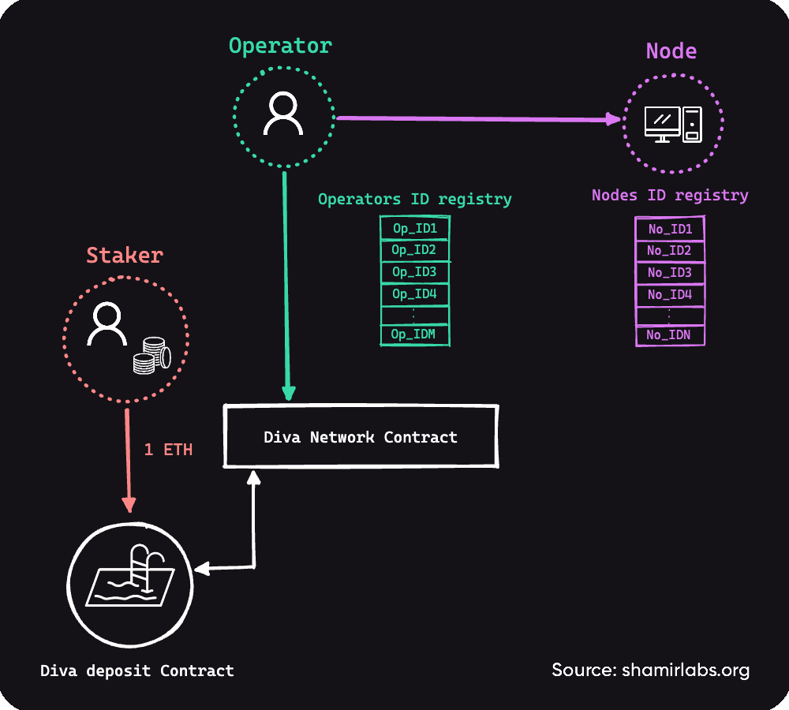
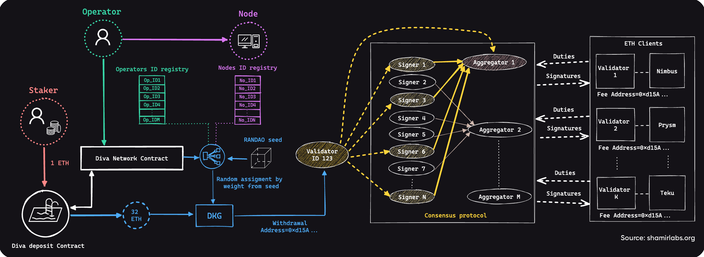

# Creation of distributed validators [WIP]

:::info
This page is a work in progress, and it contains a written version of the talk titled "The magic behind trustless distributed validators in Diva," given by Miguel Prada at DappCon 2023.

  
You can also watch the recording of the full talk here.

  

     
    

      <iframe width="560" height="315" src="https://www.youtube.com/embed/hdDsqMeJyb0?si=QIy7YF4Lwe_21MMT" title="YouTube video player" frameborder="0" allow="accelerometer; autoplay; clipboard-write; encrypted-media; gyroscope; picture-in-picture; web-share" allowfullscreen></iframe>
    

  

:::

The primary purpose of the Diva Smart Contract (DSC) is to accumulate ETH deposited into the Diva Pool and orchestrate the creation of distributed validators. Since a validator in Ethereum requires a minimum of 32 ETH to become active, the deposited ETH need to be grouped in bundles of 32 ETH before creating a new validator. Every time the DSC receives some ETH, if the pool accumulates a multiple of 32 ETH, the DSC will use the RANDAO value to generate one random seed per each 32 ETH bundle.

As described in figure above, each Diva Node (node) is constantly monitoring the events coming from the DSC, ordering a new distributed validator. Diva Nodes are registered and managed by Diva Operators (operators) who deposit collateral and collect the rewards generated by the protocol. 

One operator can manage multiple nodes, but the creation of new distributed validators is calculated using the operator's identity (thus, it doesn’t depend on the number of nodes the operator has or the identities of those nodes). Any node from any operator can participate in a Distributed Key Generation (DKG) ceremony on behalf of its operator’s identity with another group of nodes. Still, suppose multiple nodes of the same operator communicate with a single node of another operator. In that case, the other node could limit the number of requests initiated by a single operator for a given DKG UUID. This prevents spamming the network with requests when some operator has many nodes.

As an example, let's assume five operators are registered in the DSC and have different nodes assigned to them.

From this seed, the DSC calculates the UUID that represents the creation of the new distributed validator.

